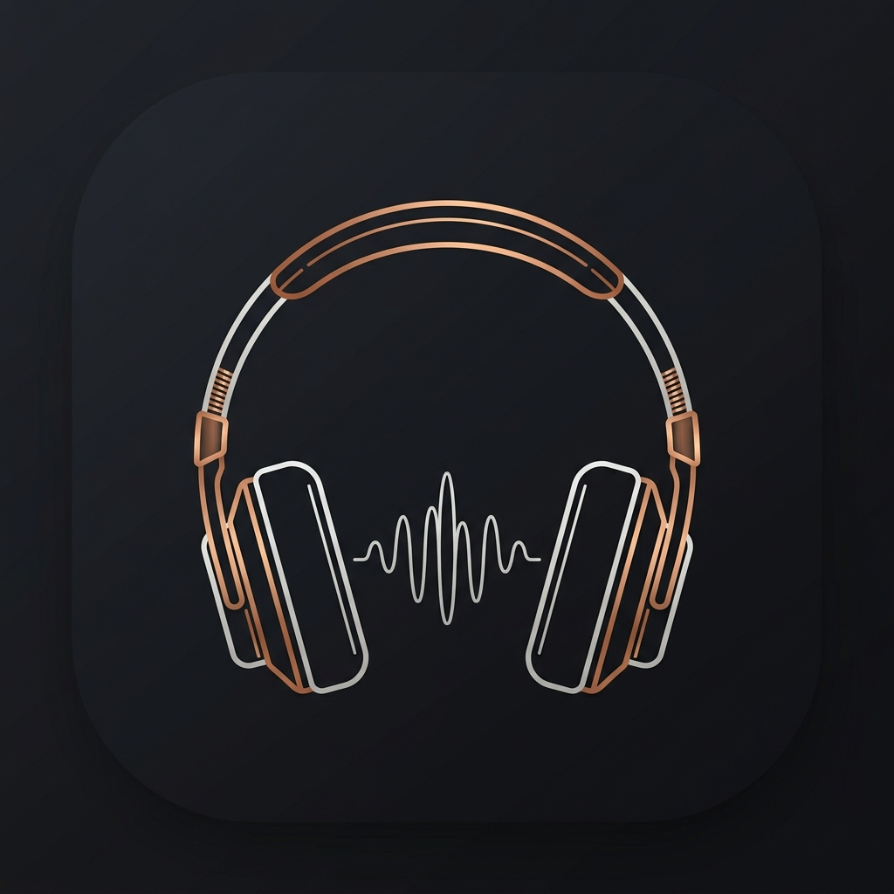

<div align="center">



# 🎵 Sonance

**The ultimate unified music suite — Stream, download Hi-Res lossless, and sing along with real-time synced lyrics.**

[](https://github.com/Sandeep2062/Sonance/releases)
[](LICENSE)
[]()
[]()
[]()

---

<p align="center">
  <b>Sonance</b> is an all-in-one flagship audiophile music workstation, studio mastering suite, and lossless streaming engine.
  <br>
  No subscriptions required. No ads. No telemetry. 100% focused on pure audio fidelity, bit-perfect hardware output, and seamless real-time lyrics.
</p>

</div>

---

## 🌟 Core Architecture & Pillars

Sonance is engineered from the ground up as a unified audiophile ecosystem:

```
                      ┌──────────────────────────────────────┐
                      │             SONANCE v4.1             │
                      └──────────────────┬───────────────────┘
                                         │
         ┌───────────────────────────────┼───────────────────────────────┐
         │                               │                               │
         ▼                               ▼                               ▼
  [ Audiophile Decoders & DSP ]   [ Hardware DAC & Bit-Perfect ] [ Real-Time Lyrics & Library ]
  • 32-bit Float Audio Engine     • WASAPI Exclusive & ASIO Direct • Multi-Provider LRC Sync
  • 36 Studio Mastering Plugins   • Android USB Direct DAC Pass  • Line & Syllable-by-Syllable
  • Dolby Atmos 7.1.4 Spatializer • Lossless FLAC / Qobuz 24-bit • Auto ID3v2/Vorbis Metadata
  • HOA 3rd Order & Binaural 3D   • Pure Integer Clock Isolation • Offline Caching & Auto-DJ
  • Sinc Interpolation Resampling • Jitter & Mismatch Immunity   • AccurateRip & Library Sync
```

---

## ⚡ Ultra-Lightweight Native Architecture (~40–80 MB RAM)

Sonance is built as a **100% pure native desktop workstation** with zero WebView2, zero Chromium, and zero Electron overhead:

- **Minimal Working Set**: Consumes only **~40–80 MB RAM** at idle (a **5–10× reduction** compared to browser-based players).
- **On-Demand DSP Workers**: Deep audio processing (Mastering, Lossless Verification, Format Conversion, Library Diagnosis) executes through ephemeral worker processes that immediately return 100% of memory to the operating system upon completion.
- **Instant Boot Time**: Native compilation ensures sub-second launch times without Chromium multi-process spin-up delays.

---

## 🖥️ Supported Platforms & System Requirements

Sonance runs natively across desktop and mobile platforms with dedicated bit-perfect audio output pipelines for each operating system:

| Platform | Minimum OS Version | Recommended | Audio Architecture | Package Types Available |
|:---|:---|:---|:---|:---|
| **Windows** | Windows 10 (64-bit) | Windows 11 (64-bit) | WASAPI Exclusive Mode, ASIO Direct, Shared AudioDG | Native Flutter `.exe`, Inno Setup Installer, Portable `.zip` |
| **macOS** | macOS 11.0 (Big Sur) | macOS 13+ (Ventura, Sonoma, Sequoia) | CoreAudio Hog Mode, System Default | Native Flutter Universal `.dmg` (Apple Silicon & Intel) |
| **Linux** | Ubuntu 20.04 / Debian 11 | Ubuntu 22.04+ / Arch / Fedora | ALSA Direct Hardware DMA (`hw:X,Y`), PipeWire, PulseAudio | Native Flutter `.deb`, `.tar.xz` |
| **Android** | Android 5.0 (Lollipop, API 21) | **Android 8.0+ / 10+** | AAudio Exclusive Mode (`EXCLUSIVE`), Direct USB DAC Passthrough | Universal `.apk` (`Sonance-android-all-arch.apk`) |

> [!NOTE]
> **Android Bit-Perfect Notice**: Android 8.0+ (API 26) or higher is recommended for low-latency AAudio streams. For bit-perfect integer clock output bypassing the Android system resampler (AudioFlinger), Android 10+ with an external USB OTG DAC is supported.

---

## ✨ Features at a Glance

Sonance unifies playback, streaming, lossless downloading, metadata tagging, and studio audio engineering into a clean, intuitive interface:

### 1. 🎵 Streaming, Global Search & Smart Fallback
- **Unified Multi-Source Search**: Search millions of tracks and albums instantly across Deezer, Spotify catalogs, and YouTube in a single search bar.
- **Zero Account Required**: Search and stream full-length songs immediately without needing to create an account or sign in.
- **Instant Seeking & Offline Cache**: High-speed HTTP byte-range audio streaming with automatic SHA-256 local caching for instant offline playback.
- **Auto-DJ & Radio Mode**: Automatically continues playback with acoustically similar tracks when your current queue finishes.

### 2. ⬇️ Lossless & Hi-Res Batch Downloader
- **Studio-Grade Audio Downloads**:
  - **Deezer**: Direct CD-quality 16-bit / 44.1 kHz FLAC (1411 kbps) and 320 kbps MP3.
  - **Qobuz**: Authentic 24-bit Studio Master Hi-Res FLAC (up to 192 kHz).
  - **YouTube & YouTube Music**: High-bitrate audio stream extraction with automated parallel batch queues.
- **Simultaneous Synced Lyrics Auto-Download**: Whenever a song is downloaded, Sonance simultaneously searches LRCLIB, Musixmatch, Megalobiz, NetEase, and Genius to save a companion `.lrc` file and embed timestamped lyrics directly into the audio tags.
- **Anti-Mismatch Verification**: Automatically checks downloaded lyric timestamps against audio duration to prevent out-of-sync lyrics.

### 3. 🔍 Smart Alternative Lossless Matcher (Song Upgrader)
- Have a favorite song or playlist on YouTube or Spotify that you want in true lossless quality?
- **Automatic High-Fidelity Matching**: Simply paste or search any YouTube video, YouTube Music link, or Spotify track/playlist. Sonance extracts the track metadata (Artist, Title, Album) and automatically queries Deezer and Qobuz for the **highest quality lossless FLAC or 320 kbps alternative**.
- Never settle for compressed 128 kbps audio when a 16-bit or 24-bit studio master exists!

### 4. 🍪 YouTube Cookie Integration (YouTube Premium High-Quality Audio)
- **1-Click Cookie Extraction**: Import cookies directly from your installed desktop browser (Chrome, Edge, Firefox, Brave, Opera) or drop your `youtube_cookies.txt` into the `cookies/` folder.
- **YouTube Premium Quality**: If you have a YouTube Premium account, importing your cookies unlocks access to high-bitrate 256 kbps AAC and pristine Opus streams instead of the free-tier standard 128 kbps audio.
- **Reliable & Unrestricted**: Eliminates YouTube bot challenges, avoids IP rate limits, and unlocks age-restricted and member-only audio tracks.

### 5. 🎤 Real-Time Synced Lyrics & Syllable Karaoke
- **Word-by-Word Syllable Sweep**: Real-time Apple Music and Spotify Sing style glowing syllable-by-syllable karaoke sweeps (`.elrc`).
- **Floating Desktop Mini-Player**: Always-on-top glassmorphic widget displaying synchronized lyrics, album art, and controls while you work or game.
- **Live Timing Drift Tuner**: Instant `[-0.5s]`, `[-0.1s]`, `[+0.1s]`, `[+0.5s]` offset buttons to adjust timing on-the-fly and save permanently to disk.
- **Multilingual Romanization & Translation**: Live phonetic Romaji (Japanese), Latin Romanization (Korean), and Pinyin (Chinese) rendering, plus bilingual translation across 50+ languages.
- **Interactive Visual LRC Studio**: Create `.lrc` files from scratch with spacebar tap-to-sync timing precision.

### 6. 🏷️ Visual Metadata & Tag Editor
- **Full Container Tagging**: Inspect and edit tags across MP3 (ID3v2.4), FLAC (Vorbis Comments), M4A/AAC (MP4 atoms), and OGG.
- **Cover Art Studio**: View, extract, replace, or strip high-resolution embedded album artwork.
- **1-Click MusicBrainz & Deezer Auto-Tagger**: Automatically populates missing titles, artist names, albums, release years, and cover artwork with one click.
- **Acoustic Audio Fingerprinting (`audio_fingerprint.py`)**: Recognizes untagged or mystery audio files (e.g., `Track01.mp3`) by their acoustic audio waveform.

### 7. 📚 Library Management, Auto-Organizer & "Library Doctor"
- **Library Doctor**: Scans your entire music library, calculates a 0–100% Library Health Score, detects duplicate audio files with bitrate/lossless quality comparisons, and cleans redundant tracks safely.
- **Rule-Based Auto-Organizer**: Automatically cleans and organizes disorganized music folders into clean directory structures:
  `%artist%/[%year%] %album%/%track% - %title%`
- **Portable DAP & Walkman Sync (`device_sync.py`)**: Synchronizes music, playlists, and `.lrc` lyrics to Sony Walkman, FiiO, Astell&Kern, and USB drives with on-the-fly transcoding and FAT32 path sanitization.

### 8. 🔄 Universal Playlist Converter & Doctor
- **Bidirectional Format Conversion**: Convert playlists seamlessly between `.m3u`, `.m3u8`, `.pls`, `.wpl` (Windows Media Player), and `.xspf` (VLC).
- **Playlist Doctor (`playlist_doctor.py`)**: Automatically repairs broken file paths when music is moved across drives, eliminates dead links, and upgrades existing lossy `.mp3` entries to `.flac`.
- **Spotify Playlist Importer**: Paste public Spotify playlist URLs to import tracklists directly into local download queues or playlists.

### 9. 🎧 Bit-Perfect Hardware DAC & Exclusive Modes
- **Bypass the Operating System Mixer**: Stream directly to external USB DACs, soundcards, and audiophile equipment with pure integer clock isolation.
  - **Windows**: WASAPI Exclusive Mode & ASIO Direct Driver Routing.
  - **macOS**: CoreAudio Hog Mode.
  - **Linux**: ALSA Direct Hardware DMA (`hw:X,Y`).
  - **Android**: AAudio Exclusive Mode (`AAUDIO_SHARING_MODE_EXCLUSIVE`) and direct USB DAC passthrough.
- **Zero Resampling & Zero Jitter**: Matches DAC sample rates dynamically ($44.1\text{ kHz}$ to $192\text{ kHz}+$) for bit-perfect output with sub-$5\text{ ms}$ buffer latency.

### 10. 🎚️ Studio Mastering Suite (36 Audio DSP Engines)
- **10-Band Studio Equalizer & Headphone AutoEq**: Hardware DSP with studio presets and Harman Target headphone calibration for 17+ audiophile headphones.
- **Spatial Audio & 7.1.4 Dolby Atmos**: Deconstructs stereo masters into immersive 12-channel 7.1.4 spatial audio beds and 360° Ambisonics (HOA 3rd Order).
- **AI Stem Separator**: Isolates Vocals, Instrumental Backing, Bass, and Drums from any song.
- **Audio Restoration**: Vinyl de-clicker, mains de-hummer, tape hiss suppressor, and audio de-clipper.
- **Mastering Dynamics**: British Class-A Console channel strip, SSL G-Master bus compressor, Teletronix LA-2A optical leveling, Fairchild 670 tube compressor, and lookahead True-Peak brickwall limiter.
- **The Grand Zenith Orchestrator (`zenith_orchestrator.py`)**: Chains 7 physical mastering DSP engines into a continuous one-click studio mastering pipeline.

### 11. 📱 Wireless Mobile Remote & Casting
- **Local Wi-Fi Remote Server**: Built-in background server (`http://<your-local-ip>:5050`) with an in-app QR code for quick camera scan connection.
- Control playback, volume, and track queues, and view **real-time synchronized lyrics on any smartphone or tablet** in your home network!

---

## ⚙️ Authentication & Accounts (Optional)

You can use Sonance completely free without creating any accounts. If you want to unlock lossless FLAC downloads, studio master audio, or private library syncing, configure the following optional settings in **Settings**:

| Service | Credentials | What It Unlocks |
|:---|:---|:---|
| **Deezer** | `Deezer ARL` | Direct 16-bit / 44.1 kHz FLAC Lossless (1411 kbps) & 320 kbps MP3 |
| **Qobuz** | `User ID`, `Token`, `App ID/Secret` | True 24-bit Studio Master Hi-Res FLAC (up to 192 kHz) |
| **YouTube & YouTube Music** | Browser cookies or `youtube_cookies.txt` | **YouTube Premium HQ audio (256 kbps AAC/Opus)**, bypasses bot checks & rate limits |
| **Spotify** | `Client ID`, `Client Secret` or `sp_dc` cookie | Import personal playlists, saved library albums, and tracks |
| **SoundCloud** | `OAuth Token` | High-bitrate track streaming & extraction |
| **Last.fm / ListenBrainz** | Username & API Session | Live background scrobbling & rich artist insights |

### How to Add YouTube Cookies (for YouTube Premium HQ Audio)
1. **Option 1 (1-Click in Sonance)**: Open Sonance, go to **Settings > Accounts > YouTube**, and click **Import from Browser** (supports Chrome, Edge, Firefox, Brave, and Opera).
2. **Option 2 (Manual File)**:
   - Export cookies using any standard browser extension (e.g. *Get cookies.txt LOCALLY*) while logged into YouTube.
   - Save the file as `youtube_cookies.txt` inside the `cookies/` folder of the Sonance directory:
     ```
     Sonance/
     └── cookies/
         └── youtube_cookies.txt
     ```
3. Once active, Sonance will automatically use your credentials to fetch highest-bitrate premium streams and avoid verification checks!

---

## 🚀 Quick Start & Installation

### Option 1: Download Pre-Built Binaries
Ready-to-use release builds are published on [GitHub Releases](https://github.com/Sandeep2062/Sonance/releases):
- **Windows**: `Sonance-windows-x86_64-setup.exe`
- **Android**: `Sonance-android-all-arch.apk`
- **macOS**: `Sonance-macos-universal.dmg`
- **Linux**: `Sonance-linux-x86_64.AppImage` or `.deb` / `.tar.xz`

### Option 2: Run From Source (Python Desktop Workstation)
```bash
# 1. Clone the repository
git clone https://github.com/Sandeep2062/Sonance.git
cd Sonance

# 2. Install Python dependencies
pip install -r requirements.txt

# 3. Launch the modern desktop workstation
python sonance.py

# Or launch the lightweight classic interface
python sonance.py --classic
```

### Option 3: Run From Source (Flutter App)
```bash
# Ensure Flutter SDK is installed (https://flutter.dev)
flutter pub get

# Run on your preferred target
flutter run -d windows    # Windows Desktop
flutter run -d android    # Connected Android device / emulator
flutter run -d macos      # macOS Desktop
flutter run -d linux      # Linux Desktop
```

---

## 🛠️ Contributor & Developer Guide

We welcome contributions of all kinds — whether you want to fix a bug, add a new DSP engine, improve the UI, or expand lyrics providers! Here is how to get started:

### 1. Prerequisites
- **Git** installed on your system.
- **Python 3.10+** (standard installation from [python.org](https://python.org)).
- **Flutter SDK 3.x** (optional, required if working on the Flutter mobile/desktop app).
- **FFmpeg** installed and accessible in your system `PATH` (recommended for audio transcoding and stem separation).

### 2. Fork and Clone
```bash
# Fork the repository on GitHub, then clone your fork:
git clone https://github.com/<your-username>/Sonance.git
cd Sonance

# Add the upstream repository:
git remote add upstream https://github.com/Sandeep2062/Sonance.git
```

### 3. Create a Feature Branch
Always create a new branch from `main` before making changes:
```bash
git checkout -b feature/your-feature-name
# Or for a bug fix:
git checkout -b fix/audio-sync-issue
```

### 4. Setup Your Development Environment
#### For Python Workstation:
```bash
# Create a virtual environment (recommended)
python -m venv venv

# Activate the virtual environment:
# On Windows (PowerShell):
.\venv\Scripts\Activate.ps1
# On Linux/macOS:
source venv/bin/activate

# Install required packages
pip install -r requirements.txt
```

#### For Flutter App:
```bash
flutter pub get
flutter doctor
```

### 5. Running the App During Development
```bash
# Run the Python desktop app:
python sonance.py

# Run the Flutter app with hot reload:
flutter run
```

### 6. Building Standalone Binaries
- **Windows Executable (PyInstaller)**:
  ```bash
  pyinstaller --noconsole --onefile --name "Sonance-windows-x86_64-setup" --add-data "ui;ui" modern_lyrics_downloader.py
  ```
- **Android APK (Flutter)**:
  ```bash
  flutter build apk --release
  ```
- **Desktop (Flutter)**:
  ```bash
  flutter build windows
  flutter build macos
  flutter build linux
  ```

### 7. Running Tests & Code Quality Audits
Before committing, verify that your changes pass all syntax checks and module integrity audits:

```bash
# Run the built-in integrity auditor across all 53 core modules and DSP engines:
python release_packager.py --audit-only
# Or via the workstation launcher:
python sonance.py --package-release --verify-only

# Verify Python syntax across all scripts:
python -m py_compile *.py

# Run Flutter tests (if working on Flutter code):
flutter test
flutter analyze
```

### 8. Commit Guidelines
We follow standard conventional commit messages to keep our Git history readable and clean:

| Prefix | Description | Example |
|:---|:---|:---|
| `feat:` | New features or enhancements | `feat: add Deezer lossless stream fallback` |
| `fix:` | Bug fixes | `fix: resolve lyrics timing drift on high-FPS visualizer` |
| `dsp:` | Audio engine, filters, or mastering plugins | `dsp: optimize biquad filter calculation in parametric EQ` |
| `ui:` | User interface and styling changes | `ui: improve floating mini-player contrast in dark mode` |
| `docs:` | Documentation improvements | `docs: add detailed contributor guide to README` |
| `refactor:` | Code restructuring without changing behavior | `refactor: simplify cookie extraction logic` |
| `test:` | Adding or updating tests | `test: add verification test for FLAC MD5 checker` |

### 9. Submitting a Pull Request (PR)
1. Push your changes to your fork:
   ```bash
   git push origin feature/your-feature-name
   ```
2. Go to [https://github.com/Sandeep2062/Sonance](https://github.com/Sandeep2062/Sonance) and click **Compare & pull request**.
3. Provide a clear summary of your changes, what problem they solve, and screenshots if you modified UI components.
4. Submit the PR — we review and merge contributions promptly!

---

## 📦 Multi-Platform Release Assets

Pre-built releases include cryptographic checksums to verify package authenticity:

| Asset Name | Target Platform | Description |
|:---|:---|:---|
| `Sonance-windows-x86_64-setup.exe` | Windows 10/11 | Standalone portable executable |
| `Sonance-android-all-arch.apk` | Android 5.0+ | Universal APK with direct USB DAC audio support |
| `Sonance-macos-universal.dmg` | macOS 11+ | Universal DMG for Apple Silicon & Intel Macs |
| `Sonance-linux-x86_64.AppImage` / `.deb` | Linux | Portable AppImage and Debian package |
| `RELEASE.sha256sum` | All | SHA-256 integrity verification hash list |
| `RELEASE.md5sum` | All | MD5 verification hash list |

### Verifying Download Integrity
- **Windows (PowerShell)**:
  ```powershell
  Get-FileHash -Algorithm SHA256 .\Sonance-windows-x86_64-setup.exe
  ```
- **Linux & macOS**:
  ```bash
  sha256sum -c RELEASE.sha256sum
  ```

---

## 🏷️ Version Bumper & Release Automation

To update the version consistently across all components (Flutter, Python, HTML/JS, CMake, and release manifests):

```bash
# Windows PowerShell:
.\bump_version.ps1 3.7.0

# Linux / macOS / Git Bash:
./bump_version.sh 3.7.0

# Direct Python engine:
python update_version.py 3.7.0
```

---

## 📈 Star History

<div align="center">

[](https://star-history.com/#Sandeep2062/Sonance&Date)

</div>

---

## 📄 License

This project is licensed under the **GNU General Public License v3.0 with Commons Clause**:
- **Attribution (Credit)**: Must credit **Sandeep Khadka**.
- **Copyleft**: Derivative works must remain 100% open-source under the same license — cannot be made proprietary or closed-source.
- **Non-Commercial**: Selling or commercial monetization of the software is strictly prohibited under the Commons Clause condition.

See [LICENSE](LICENSE) for full details.

---

<p align="center">
  Crafted with ❤️ by <a href="https://github.com/Sandeep2062"><b>Sandeep Khadka</b></a>
</p>
